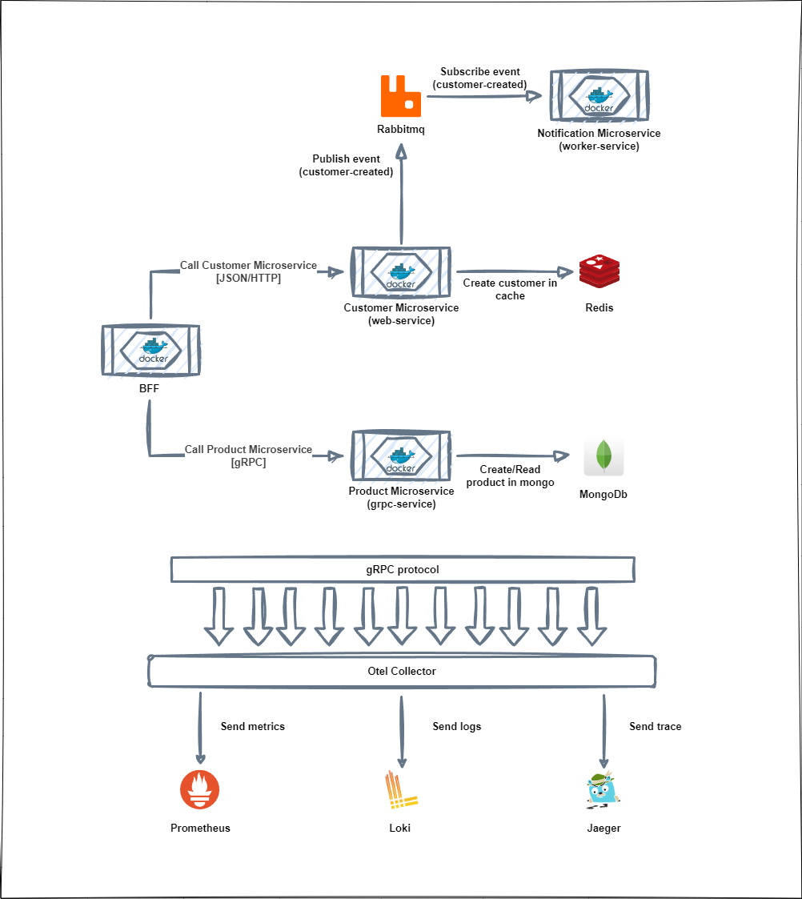

# Otel Sample dotnet a open-source project written in .NET Core and implements open telemtry best pratices :sunglasses:

* The goal of this project is implement the most common used technologies.

## Give a Star! :star:

If you liked the project, please give a star ;)

## You need some of the fallowing tools :exclamation:

* Visual Studio 2022 or Visual Studio Code
* .Net 7
* Docker

## Architecture :heavy_check_mark:

*  Minimal APIs
* Separation of technology details from the rest of the system
* Single responsibility of each layer
* BFF strategy
* gRPC Client & Server
* Open Telemetry

## Map

